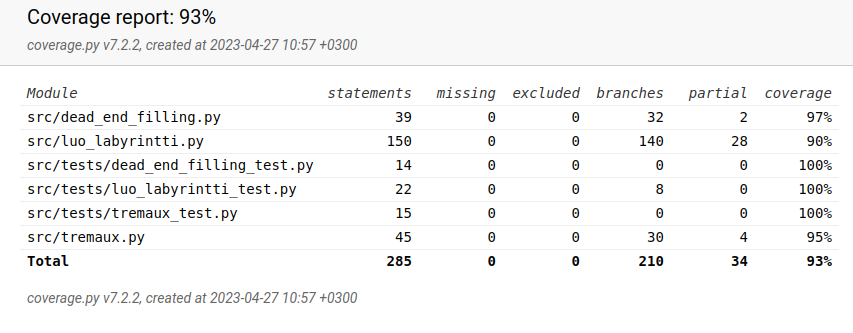
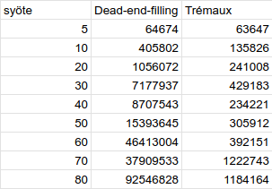
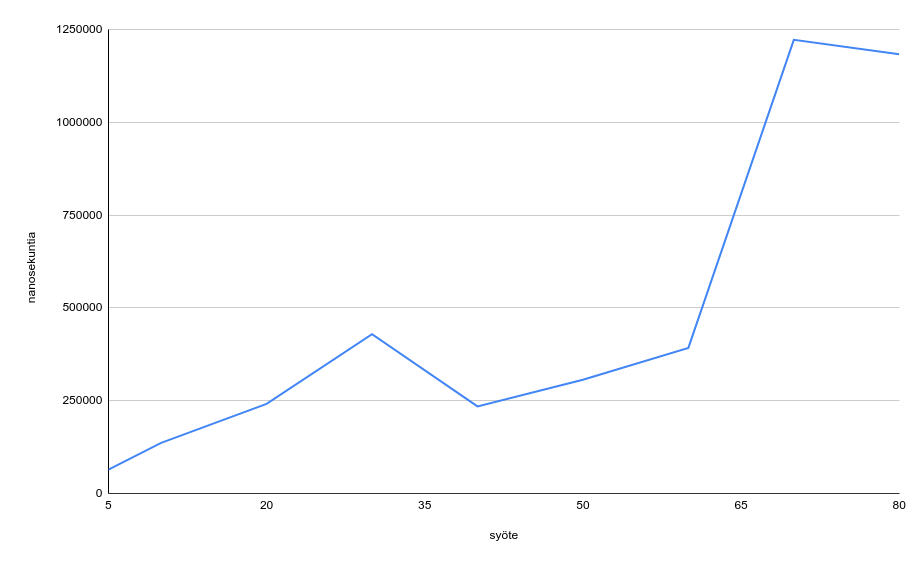
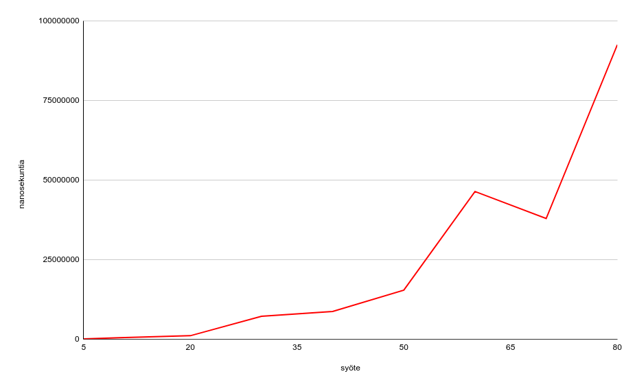
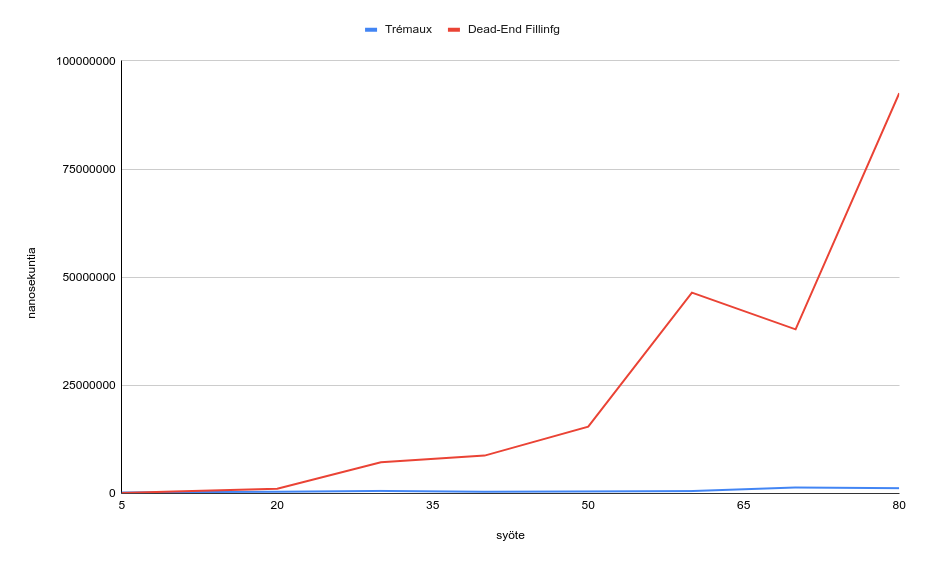

# Testausdokumentti

## Projektin testaus

Tämä projekti on testattu yksikkötestauksella unittestin avulla. Testaus kattaa src-kansion tiedostot poislukien index.py tai ui.py tiedostot. Testejä on yhteensä kahdeksan, ja ne testaa eri ohjelman toiminnan kannalta tärkeiden funktioiden toimintoja. Nämä testit testaavat muun muassa labyrintin luomista, sen eri ratkaisuja ja ratkaisualgoritmeien eri toimintoja. Testit voidaan suorittaa komennolla `` pytest src ``. 

## Pylint virheet ja koodin laatu

Pylint antaa koodin arvosanaksi 10/10 ja arvosanan voi suorittaa komennolla `` poetry run invoke lint ``.

## Järjestelmän toiminta

Järjestelmä antaa virheilmoituksen aina, jos käyttäjä syöttää liian suuren tai pienen luvun.

## Suorituskyky

Testaamalla ohjelman toimintaa nxn kokoisilla syötteillä, saadaan luotua kaaviot, jotka kuvaavat algoritmien nopeutta eri kokoisilla syötteillä.
Seuraavassa taulukossa on tieto syötteiden koosta ja kummankin algoritmin ratkaisunopeudesta. Nopeus on ilmaistu nanosekunteina.

Seuraavassa taulukossa on kuvaus Trémauxin algoritmin nopeudesta:

Seuraavassa taulukossa on kuvaus Dead-End-Filling algoritmin nopeudesta:

Kun laitetaan molemmat kaaviot yhteen, huomataan, että Dead-End Filling -algoritmi on reilusti Trémauxin algoritmia hitaampi.

