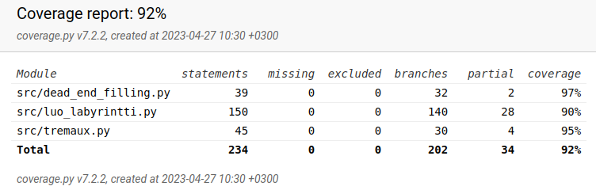

# Testausdokumentti

## Projektin testaus

Tämä projekti on testattu yksikkötestauksella unittestin avulla. Testaus kattaa src-kansion dead_end_filling.py, luo_labyrintti.py ja tremaux.py tiedosot, eikä ota huomioon index.py tai ui.py tiedostoja. 

