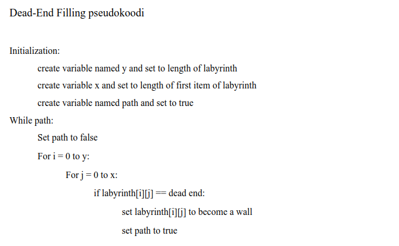
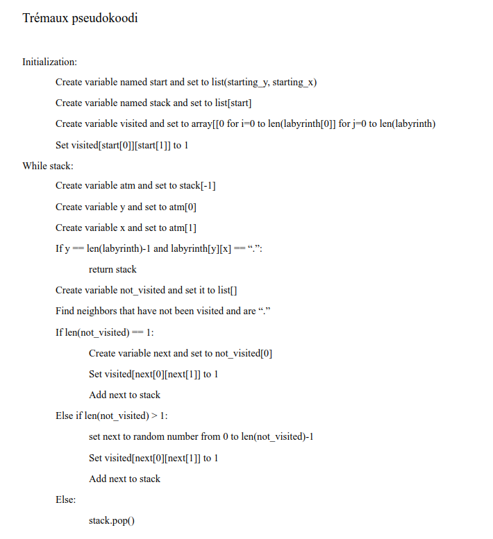

# Toteutus

## Ohjelman yleisrakenne

Ohjelman labyrintti luodaan käyttäjän antamilla parametreillö luo_labyrintti.py -tiedostossa. Labyrintti luodaan Primin algoritmilla.
Ohjelma vertailee Dead-End Filling -algoritmia ja Trémauxin algoritmia labyrintin ratkaisemiseen. Dead-End Filling toteuttaa ratkaisemisen ilman luokkamuotoa ja 
Trémaux toteuttaa sen luokkamuodossa.

Tiedostot index.py ja ui.py pitävät huolen ohjelman toiminnallisuudesta ja ulkoasusta. Testitiedostoja on kolme, ja ne testaavat labyrintin luomista ja molempia
ratkaisualgoritmeja.

## Aika- ja tilavaativuudet

Dead-End Filling -algoritmin aikavaativuus on O(n²), sillä sillä on kaksi sisäkkäistä for-silmukkaa. Algoritmin tilavaativuus O(1), sillä se muokkaa koko ajan samaa
taulukkoa, eikä luo kopioita tai säilytä muuta muistitietoa.

Dead-End Filling algoritmin pseudokoodikuvaus:

Trémauxin algoritmin aikavaativuus on O(n+m), missä n on solmujen määrä ja m on kaarten määrä. Algoritmin tilavaativuus on O(n), sillä se pitää mukanaan toista taulukkoa, jota muokataan samalla kun liikutaan labyrintissä.

Trémauxin algoritmin pseudokoodikuvaus:

## Parannusehdotuksia ja puutteita

Ohjelmaa voisi parantaa niin, että käyttöliittymä olisi graafinen. Puutteita on esimerkiksi se, että ohjelma on todella hidas tai jämähtää suurilla syötteillä.

Lähteet:
https://en.wikipedia.org/wiki/Maze-solving_algorithm
https://en.wikipedia.org/wiki/Depth-first_search
http://blog.jamisbuck.org/2014/05/12/tremauxs-algorithm.html
https://en.wikipedia.org/wiki/Tr%C3%A9maux_tree
https://forum.arduino.cc/t/how-to-implement-tremaux-explore-algorithm-for-a-maze/632390
